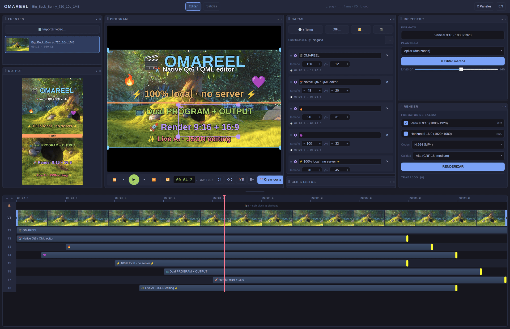

# OmaShort



[Watch the rendered keyframes, easing and fades demo](examples/omashort-keyframes-fades-preview.mp4)

Local clip editor for Omarchy. **Native C++/Qt6/QML build — no server,
no internet, no Electron.** Processing via the system ffmpeg/ffprobe.

The retired HTML/Electron prototype (server/ + electron/ + CDP tests) is
archived separately; the only active product is `native/`.

## Architecture

```
native/
  src/engine.{h,cpp}   C++ engine: worker thread + task queue
  src/main.cpp         entry point, --selftest, --uitest* flags
  qml/                 QML UI: main.qml (dock), Timeline, Panel, OverlayLayers,
                       OutputPreview, RegionEditor, Theme.js (tokens), I18n.js
  qml.qrc              embedded release fallback for the complete QML UI
  omashort-native.pro  qmake6
```

- `QProcess` over the system ffmpeg/ffprobe (local performance, no wasm).
- Data in `~/.local/share/omashort/` (the legacy directory is migrated automatically):
  - `media/` sources, `media/clips/` cuts and `out/thumbs/` shared media caches
  - `projects/<project-id>/out/` project-scoped renders (`*-v.mp4` vertical,
    `*-h.mp4` horizontal); **Finished clips never leak between projects**
  - `project.json` AI-editable project with live reload
  - `native-qml/` optional mutable QML override; release binaries also embed the UI

## Build & run

```bash
cd native && qmake6 omashort-native.pro && make -j4
./omashort-native              # GUI (Wayland/Hyprland)
QT_QPA_PLATFORM=offscreen ./omashort-native --selftest   # headless pipeline: render -> verify
sudo make install             # installs the binary and bundled ASR helper

# deterministic flags for screenshots/verification:
--uitest            # trim 5-10s, loop, 2 text layers
--uitest-out        # enters Outputs mode
--uitest-dock       # reordered dock + collapsed inspector
--uitest-blocks     # 3 blocks (full/stack/circle)
--uitest-pause      # deterministic pause at 2.6s (same path as Space)
--uitest-render     # dual v+h render through the RENDER panel path
```

Deploy QML to the VM: `rsync -a --delete native/qml/ <vm>:~/.local/share/omashort/native-qml/`

### Android tablet build

OmaShort uses the package id `cl.villagranquiroz.omashort`, opens in landscape,
imports videos from Android's document picker, and uses Qt Multimedia for local
preview playback. Releases published under the retired codename use a different
package id and are retained only as historical previews.

The current Android build does not bundle command-line ffmpeg/ffprobe, so local
render export and offline ASR remain desktop-only until native Android media
backends are integrated.

### Offline subtitles

The subtitle action launches `native/scripts/transcribe_local.py` locally. It
never downloads a model or contacts a service. Point it at an existing
faster-whisper environment and CTranslate2 model:

```bash
export OMASHORT_ASR_PYTHON=/path/to/faster-whisper-venv/bin/python
export OMASHORT_ASR_MODEL=/path/to/local-ctranslate2-model
# Optional when the script is not at ./scripts/transcribe_local.py:
export OMASHORT_ASR_SCRIPT=/path/to/transcribe_local.py
```

Normal mode burns the generated SRT in a fixed movie position. Reel mode turns
each cue into an editable, timed text layer.

### Timeline regression tests

The timeline tests load the actual QML component and send Qt mouse events
headlessly. PySide6 is a test-only dependency; the editor remains C++/Qt6.
From the repository root:

```bash
uv venv /tmp/omashort-qt-tests
uv pip install --python /tmp/omashort-qt-tests/bin/python PySide6
QT_QPA_PLATFORM=offscreen QT_QUICK_BACKEND=software \
  /tmp/omashort-qt-tests/bin/python -m unittest discover -s native/tests -v
```

For isolated native pipeline checks, set `OMASHORT_DATA` to a temporary
directory containing a `media/` folder with a real source video before
running `--selftest`; this avoids touching your working project.

### Native live-editing integration test

This test runs the real C++ engine and production QML in an isolated project.
A separate Python process edits `project.json`, including repeated atomic
replacements, and checks the visible PROGRAM, OUTPUT and timeline text,
independent positions, color and trim values. It also types into the real
layer input using Qt keyboard events, checks focus and autosave, then performs
another external edit. Screenshots, observations and timings are retained in
the temporary directory printed by the test.

Requires Qt 6.5+ Quick, Multimedia and Test development packages, Python 3 and a
real source video of at least ten seconds. From the repository root:

```bash
repo="$PWD"
build="$(mktemp -d /tmp/omashort-live-build-XXXXXX)"
(cd "$build" && qmake6 "$repo/native/tests/live_reload.pro" && make -j4)
python3 native/tests/live_reload_e2e.py \
  --binary "$build/live-reload-probe" --qml "$repo/native/qml/main.qml" \
  --video /absolute/path/to/source.mp4
```

The default offscreen software mode verifies UI text and geometry, not video
frame presentation. Add `--platform wayland` from a graphical session to run
the same test with native video previews. Neither mode edits your working
project or restarts the installed editor.

## Features (UI)

- Dockable panels: SOURCES | PROGRAM+OUTPUT | LAYERS+GALLERY | INSPECTOR+RENDER.
  Header drag (6px threshold), double-click = collapse, ✕ closes, **⊞ Panels**
  re-enables them. Proportional resize via colFr/rowFr fractions.
- PROGRAM: source monitor with RegionEditor pinned to `VideoOutput.contentRect`
  (exact WYSIWYG crop). OUTPUT: live 9:16 vertical preview.
- **Dual-format editing**: every layer has `x,y,w,h` (OUTPUT 9:16) and
  `px,py,pw,ph` (PROGRAM/source) — dragging on one monitor never touches the other.
- Custom NLE timeline: adaptive ruler, cached filmstrip, in/out trim,
  playhead, A-B loop, zoom, blocks (B track) with per-segment layouts
  (full/stack/pip/circle), track reorder from V1/T1/T2 headers,
  pinned to the bottom and vertically resizable only (`tlHeight`).
- Magnetic timeline snapping: clip and trim edges align to the playhead,
  other clip boundaries, and the source limits within an 8-pixel threshold.
  Toggle **Snap** on the timeline or hold **Alt** while dragging to bypass it.
  Moving a range preserves its duration; dragging either edge resizes it.
- Right-drag the trim band or either trim handle to move the whole selection
  without changing its length, including at the source boundaries.
- Layers: text (QPainter rasterized), GIF, image, PiP video with shape
  (rect/rounded/circle — live MultiEffect mask, alphamerge+PNG mask on render).
- Layer keyframes tween position, dimensions and text size with linear, ease-in,
  ease-out, ease-in-out, back-out or bounce curves. Per-layer opacity and
  fade-in/fade-out are identical in the live previews and rendered MP4.
- RENDER panel: vertical and/or horizontal format at once, H.264/H.265/VP9 codec,
  CRF 18/23/28 quality, job queue with progress.
- `project.json` project: ~1.5s autosave + **live reload** on external edits
  (QFileSystemWatcher + hash guard) — designed for LLMs.
  Format: `docs/project-format.md`.
- `examples/keyframes-fades-demo.project.json` is a portable 10-second demo;
  open it directly to inspect the layouts, keyframes, tweens and fades.
  Its committed abstract source can be regenerated offline with
  `python3 examples/generate_demo_source.py` (Pillow and ffmpeg are required).
- es/en i18n (`qml/I18n.js`), persisted in the engine.

## Render engine

- Per-block filtergraph: trim → layoutChain (cover-crop per region, apilar
  vstack, square PiP = smaller side/2, circle = alphamerge with PNG mask)
  → setsar=1 → concat (video + audio) → overlays clamped to the base duration
  (sum of blocks) with `enable='between(t,inS,outS)'`.
- Layer space: `space="out"` uses x,y,w,h; `space="prog"` uses px,py,pw,ph.
- Codec tail: libx264/libx265(-tag:v hvc1)/libvpx-vp9(-b:v 0), `-r <fps>`,
  faststart, output `<jobId>[-v|-h].mp4`.

## Anti-black playback (GStreamer/Qt Multimedia)

`VideoOutput` goes black on pause/EndOfMedia on some pipelines:
- `pausePlayback()` = pause + micro-seek +1ms (forces frame preroll).
- Guard: rewind ~0.25s before EndOfMedia.
- Fallback: play ~90ms + pause if it already fell into StoppedState.
- Same policy for secondary players (OUTPUT) via `syncPlayer()`.

## Pitfalls

- Never declare `property var layer` on an Item: it collides with the FINAL
  `layer` member of QQuickItem → silent crash (exit 255, no log).
- qDebug/qWarning are silenced in release on Omarchy — use
  `fprintf(stderr, ...)` for diagnostics.
- Qt drops QFileSystemWatcher paths after rename-replace: re-add the path
  when processing fileChanged.
- Infinite overlays hang ffmpeg 9: always `trim=duration=…` + setpts.
- `rsync --delete` of the QML targets `~/.local/share/omashort/native-qml/`, not the
  source tree.

## Known issues

- The MAIN source-frame rectangle can drift by a very small amount while it is
  resized from a corner. PiP corner resizing does not exhibit this drift.

## Verified state (2026-09-12, Omarchy aarch64 host)

- `--selftest`: PASS (1080×1920 render verified with ffprobe).
- Dual render end-to-end: `-v.mp4` 1080×1920 and `-h.mp4` 1920×1080, both
  10.000s with 0-10s blocks; layers respect inS/outS
  (`between(t,5,10)` / `between(t,6,9)`); texts in different positions per
  format (dual-space confirmed visually).
- Exported keyframe motion and size tweening are checked from decoded pixels;
  fade-in/fade-out are checked at the beginning, middle and end of a real MP4.
- The portable demo render is 1080×1920, H.264, 30 fps, 10.000 s and 300
  decoded frames (`examples/omashort-keyframes-fades-preview.mp4`).
